# 🛡️ SleepGuard: Autonomous Sleep Protection Agent

> "The first AI agent that doesn't just track sleep—it protects it."

An agentic loop that senses biomarkers, predicts risks using ML, and intervenes via Android actuators.

---

## 🧠 The "Agentic" Architecture
SleepGuard is not a passive dashboard. It is a closed-loop autonomous system where three distinct layers work together to modify the user's environment in real-time.

```mermaid
graph TD
    A[📱 Android Sensors] -->|JSON Payload| B(🐍 Python ML Layer)
    B -->|Risk Scores| C{🧠 Gemini Agent}
    C -->|Reasoning + Tradeoffs| D[📉 Decision Engine]
    D -->|Action JSON| E[🔔 Android Actuators]
    E -->|Real World Change| A

```



### 1. The Body (Android)

* **Senses:** Ambient noise (dB), Screen exposure (lux/time), User logs.
* **Acts:** Modifies alarms, blocks apps, plays white noise, triggers wind-down notifications.
* **Tech:** Kotlin, Retrofit, UsageStatsManager, AlarmManager.

### 2. The Brain (Python ML)

* **Predicts:** Caffeine half-life decay, Melatonin suppression risk.
* **Tech:** Flask, NumPy, Scikit-learn logic.

### 3. The Mind (Gemini LLM)

* **Decides:** Weighs "Sleep Debt" vs. "Social Obligations" vs. "Bio-Availability."
* **Tech:** Google GenAI SDK (gemini-1.5-flash), Prompt Engineering, JSON Schema Validation.

---

## 🔬 Scientific Logic (The "Why")

Unlike basic trackers, SleepGuard uses clinical thresholds to trigger interventions.

| Biomarker | Threshold | Risk | Intervention |
| --- | --- | --- | --- |
| **Caffeine** | > 350mg | Stimulation | **Adjust Alarm** (+30m recovery) |
| **Blue Light** | > 0.8 Score | Melatonin suppression | **Digital Wind-Down** (Warning) |
| **Noise** | > 65dB (avg) | REM Fragmentation | **White Noise** (Adaptive Masking) |
| **Sleep Debt** | > 1.5 Hours | Chronic Fatigue | **Schedule Shift** (Auto-Reschedule) |

*Reasoning Engine powered by PubMed-validated system prompts.*

---

## ⚡ Setup Guide (For Developers/Backend Testing)

### Prerequisites

* Python 3.10+
* Google Gemini API Key
* Android Studio (Ladybug or newer)

### 1. Clone & Configure

```bash
git clone [https://github.com/YOUR_USERNAME/SleepGuard-Hackathon.git](https://github.com/YOUR_USERNAME/SleepGuard-Hackathon.git)
cd SleepGuard-Hackathon

```

### 2. Set the API Key

Create a `.env` file in the `backend/` folder (or `local.properties` for Android):

```bash
GOOGLE_API_KEY=your_gemini_api_key_here

```

### 3. Start the Brain (Backend Simulation)

```bash
cd backend
pip install -r requirements.txt
python app.py
# Server starts at [http://127.0.0.1:5000](http://127.0.0.1:5000)

```

### 4. Test the Agent (No Android required)

Open a terminal and simulate a "High Risk" night:

```powershell
Invoke-RestMethod -Uri [http://127.0.0.1:5000/process_data](http://127.0.0.1:5000/process_data) -Method POST -ContentType "application/json" -Body '{
    "caffeine_log": [{"mg": 400, "time": "20:00"}],
    "screen_minutes": 145,
    "sleep_debt_hours": 2.5
}'

```

**Expected Response:** `{"action": "ADJUST_ALARM", "urgency": "HIGH", ...}`

---

## 📱 Judge's Guide: Live Mobile Demo

**Follow these 3 Steps to see the Agent in action.**

### Scenario A: The "Caffeine Crash" (Autonomous Scheduling)

*Goal: Prove the agent can modify future plans based on biological state.*

1. **Open App** and go to the **Schedule Tab**.
2. **Add a Task:** Type `07:00` and `Wake Up`. Click **ADD**.
* *Observation:* Task appears as "07:00 - Wake Up".


3. **Trigger Risk:** Go to the **Data Tab**, tap **Caffeine**, enter **400** mg, and click **Save**.
* *Observation:* A toast appears: *"⚠️ High Caffeine! Schedule adjusted."*


4. **Verify Action:** Return to the **Schedule Tab**.
* *Result:* The task has autonomously moved to **07:30**. A red alert banner explains why.


### Scenario B: The "Adaptive Shield" (Noise Protection)

*Goal: Prove the agent listens and reacts to the environment in real-time.*

1. Go to the **Sleep Tab** (White Noise).
2. Tap **"Play Smart Noise"** (Allow Mic permission if asked).
3. **Quiet Test:** Stay silent.
* *Result:* Status says "🌙 Gentle Masking" (Volume Low).


4. **Loud Test:** Clap your hands or speak loudly.
* *Result:* Status jumps to "🛡️ Blocking Noise" and the **volume bar increases** automatically.


### Scenario C: The "Agent Chat" (Reasoning)

*Goal: See the 'Mind' explain its decisions.*

1. Go to the **Agent Tab**.
2. Type **"Status"** or **"What did you do?"**
3. *Result:* The Agent (Gemini) will reply: *"I detected high caffeine intake (400mg). I have shifted your schedule by 30 minutes to allow for adenosine clearance."*

---

## 📂 Project Structure

```plaintext
/SleepGuard-Hackathon
├── /app                  # Android Client (Kotlin + Chaquopy Python Bridge)
│   ├── src/main/java     # UI & Sensor Logic
│   └── src/main/python   # Embedded ML & Agent Logic (launcher.py)
├── /backend              # Standalone Python Server (For logic validation)
│   ├── app.py            # Flask Entrypoint
│   └── llm_wrapper.py    # Gemini Integration
└── README.md

```

